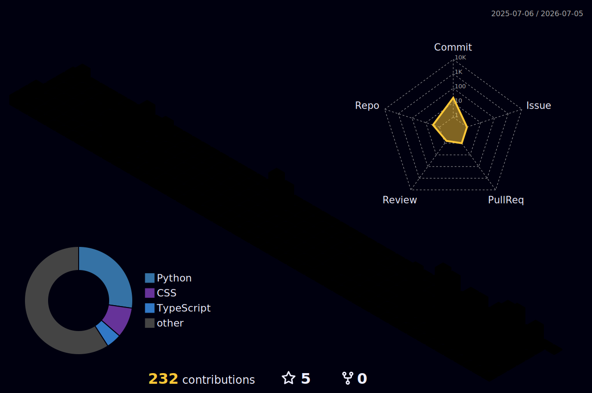

# Hi, I'm Sangmyeong [Scott] Lee
<table>
  <tr>
    <td width="50%" align="center">
      
    </td>
    <td width="50%" align="center">
      
    </td>
  </tr>
</table>

## Tech Stack

<table>
  <tr>
    <td><b>Databases</b></td>
    <td>
      
      
      
    </td>
  </tr>
  <tr>
    <td><b>Languages</b></td>
    <td>
      
      
      
      
      
      
    </td>
  </tr>
  <tr>
    <td><b>ORMs / Frameworks</b></td>
    <td>
      
      
      
      
      
      
    </td>
  </tr>
  <tr>
    <td><b>Tools</b></td>
    <td>
      
      
      
      
      
    </td>
  </tr>
</table>

## Experience & Activity

```yaml
2025.08 ~ Present: Junior Researcher at PLANTO Business Consulting, Korea
    Developed FSS-compliant Accountability Management System at:
    ㄴ 2026.04 ~ Present: KORAMCO REITs Management and Trust & KORAMCO Asset Management
    ㄴ 2025.12 ~ 2026.04: Kyobo Life Insurance
    ㄴ 2025.09 ~ 2025.12: NH NongHyup Life Insurance
2022.11 ~ 2023.02: Front-End Developer Intern at LinkCloud Pty Ltd, Australia
2021.12 ~ 2022.02: Events Main Presenter at Cochlear Korea, Korea
2021.02 ~ 2024.10: B.Sc. in Computer Science & Software Development, The University of Sydney, Australia
    ㄴ 2023.06 ~ 2023.11: ML Research Engineer at CS Capstone Project (with Civil Engineering faculty)
    ㄴ 2022.07 ~ 2022.11: Member at SUDATA (Sydney University Data Society)
```


